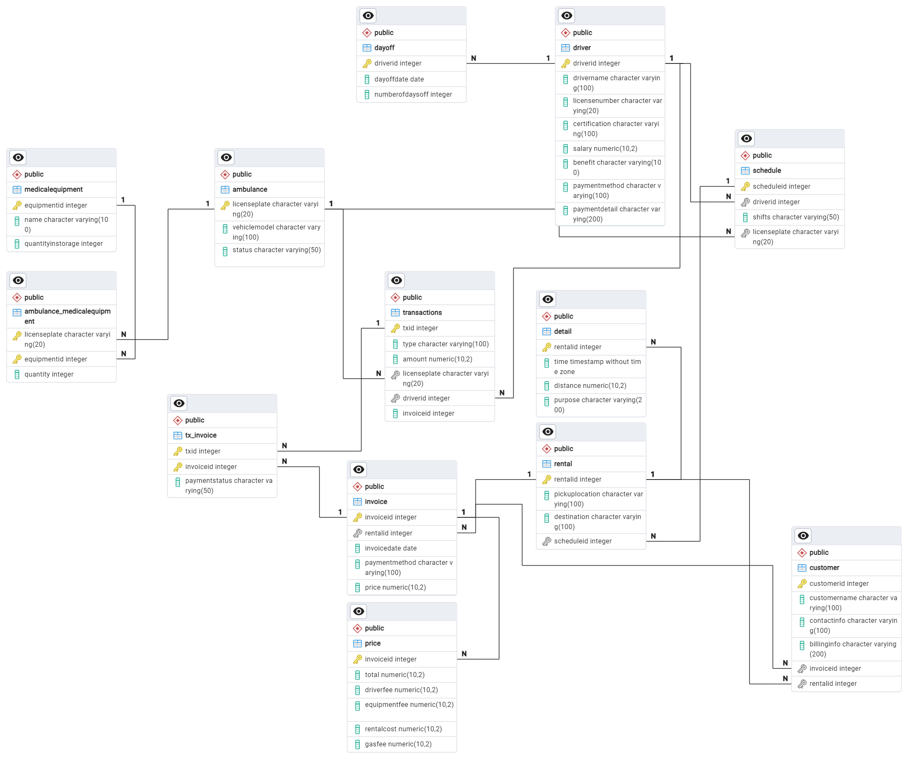

# Ambulance Management System
<h3 align="center">Ambulance Management System</h3>

A private ambulance service management system 

## About the projects
Welcome to Ambulance Management System, this system is designed as a comprehensive solution for efficiently managing private ambulance services.  
It provides a user-friendly interface for both administrators and ambulance staff to manage various aspects of ambulance operations, including dispatching, scheduling, tracking, and reporting.  
As a culmination of learning in the subject 'Principle of Database Systems', this project serves as a testament to the application of database principles in real-world scenarios. Developed as a bonus credit endeavor for the final exam, it represents a synthesis of theoretical knowledge and practical skills acquired throughout the course.

### Built with

      

Project's ERD and relational table built with draw.io

## Features
- **Ambulance Management**: Add, update, and track information about ambulances, including license plate, vehicle model, and status.
- **Driver Management**: Manage drivers, their certifications, salaries, benefits, and payment details.
- **Rental Scheduling**: Schedule ambulance rentals with specific drivers, pickup locations, destinations, and timestamps.
- **Invoice Generation**: Generate invoices for rentals, including details of charges, payment methods, and payment statuses.
- **Transaction Tracking**: Track transactions related to rentals, including payments made by customers.
- **Customer Management**: Manage customer information and track their interactions with the rental service.

## Database Schema
The project uses a relational database with the following schema:
- Ambulance
- MedicalEquipment
- Ambulance_MedicalEquipment
- Driver
- Dayoff
- Schedule
- Rental
- Invoice
- Transactions
- Price
- TX_Invoice
- Detail
- Customer

## ERD Overview

## Setup
1. **Database Setup**: Import the provided SQL script to set up the database schema and populate initial data.
2. **Configuration**: Update database connection settings in the project configuration file.
3. **Run**: Execute the project to start the application.

## Usage
- **Ambulance Management**: Use CRUD operations to manage ambulance information.
- **Driver Management**: Add, update, or remove drivers from the system.
- **Rental Scheduling**: Schedule rentals for ambulances with specific drivers and pickup locations.
- **Invoice Generation**: Generate invoices for rentals and track payment statuses.
- **Customer Interaction**: Manage customer information and track rental interactions.

